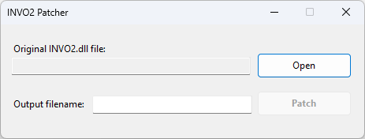

## INVO2 Patcher

INVO2 Patcher is a tool to modify the `INVO2.dll` file and provide an infinite license for the INVO2 software.

### Disclaimer

INVO2 Patcher is an independent tool developed by a third-party and is not affiliated with the creators of INVO2 software. The patcher is provided "as is" without any warranties. The usage of this tool is at your own risk. The developers of INVO2 Patcher shall not be held responsible for any damages or legal issues arising from the use of this tool.

### Installation

1. Download the latest version of INVO2 Patcher from the [releases](https://github.com/username/repo/releases) page.
2. Extract the downloaded ZIP file to a location of your choice.
3. Navigate to the extracted folder and run `INVO2_Patcher.exe` as an administrator.

### Usage

1. Launch INVO2 Patcher by double-clicking on `INVO2_Patcher.exe`.
2. Click on the "Open" button and manually locate the `INVO2.dll` file.
3. Click on the "Patch" button to initiate the license patching process.
4. A success message will be displayed upon successful patching.
5. `*_patched.dll` file will be created in the folder with the original file
6. Rename `*_patched.dll` to `INVO2.dll` and replace the original file
7. Enjoy using INVO2 with an infinite license!

### Requirements

- Windows operating system (compatible with Windows 7, 8, and 10)
- INVO2 software installed (version 2.0.1.0 or later)
- .NET 6 runtime installed
- Administrative privileges for applying the patch

### Limitations

- The INVO2 Patcher is designed to work with specific versions of the INVO2 software. Make sure you are using a compatible version to ensure successful patching.
- Using INVO2 with an infinite license obtained through this patcher may violate the software's end-user license agreement (EULA). Please use this tool responsibly and in compliance with the software's terms and conditions.
